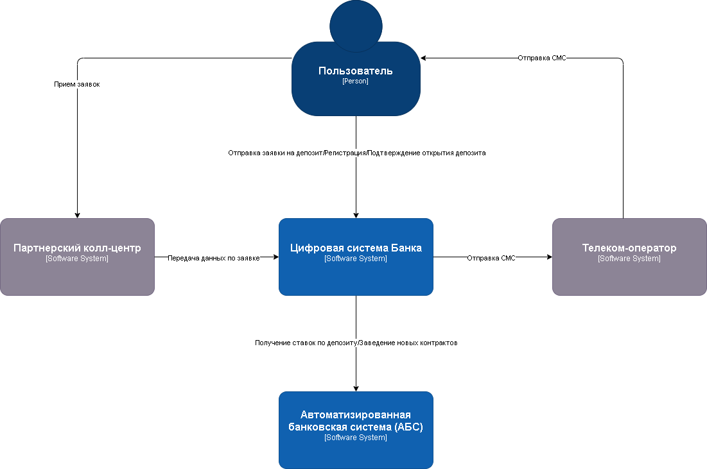

### **Название задачи:** 
### **Автор:**
### **Дата:**
### **Функциональные требования**
Ниже приведены Use Cases, исходя из функциональных требований.

|**№**|**Действующие лица или системы**|**Use Case**|**Описание**|
| :-: | :- | :- | :- |
| UC1 | Пользователь, Сайт, Колл-центр | 1. Пользователь переходит на сайт и видит список доступных депозитов с актуальными ставками  2. Пользователь оставляет заявку на депозит на сайте указав свой номер телефона и Ф.И.О. 3. Сайт передает данные по заявке в систему колл-центра, далее ее обрабатывает менеджер | Объединяем требования F1, F2, F3 в один Use Case |
| UC2 | Пользователь, Фронт-офис, Интернет-банк, АБС, Бэк-офис  | 1. Пользователь приходит в отделение для идентификации и менеджер регистрирует его в Интернет-банке  2. Данные пользователя передаются в АБС, на основе которых сотрудники Бэк-офиса рассчитывают персонализированную ставку| Объединяем требования F4, F7 |
| UC3 | Пользователь, Интернет-банк, АБС, Бэк-офис, СМС-шлюз | 1. В интернет-банке пользователь видит список доступных депозитов с актуальными ставками и персонализированные ставки лично для него  2. Пользователь подает заявку на открытие депозита, указав счёт и сумму депозита  3.Сотрудник бэк офиса подтверждает условия депозита в АБС  4. Система отправляет СМС с одноразовым кодом через СМС-шлюз  | ... |
|||||
### **Нефункциональные требования**
Выделим нефункциональные требования и архитектурно значимые требования в отдельную таблицу. Рассмотрим только требования категорий R, P и +, так как эти требования могут влиять на архитектуру решения.

|**№**|**Требование**|
| :-: | :- |
| **R**   | **Надёжность (Reliability)**           |              |
| R1    | Доступность системы 99,9%                                |              |
| R2    | Время работы всех сервисов 24/7.                                |              |
| R3    | Горячее резервирование между ЦОД                                |              |
| **P**   | **Производительность (Performance)**   |              |
| P1    | Отклик по всем операциям не более 100 миллисекунд                                |              |
| P2    | Исправить долгую загрузку данных из справочника > 1 сек                                |              |
| **+R**  | **+ Ограничения (Restrictions)**       |              |
| +R1    | БД АБС системы перегружена не может обеспечить работоспособность при большом кол-ве заявок                                 |              |
| +R2    | АБС система может масштабироваться только вертикально                                |              |
| +R3    | Запрещены прямые вызовы Интернет-банка с API АБС                                |              |
| +R4    | Использовать Kafka на перспективу, но текущая платформа ИБ с ней несовместима                                |              |
| +R5    | Рассмотреть перевод интернет-банка на микросервисную архитектуру, но пока только в рамках задачи открытия депозитов                                |              |
| +R6    | Чувствительные данные с Сайта и Интернет-банке необходимо шифровать                                |              |

### **Решение**
Диаграмма контекста C4

Диаграмма контейнеров C4

### **Альтернативы**
1. Прямые вызовы ИБ - АБС (SOAP/PLSQL): меньше компонентов, но сильная связность, риски безопасности, сложность версионирования
2. Событийная шина (Kafka) сразу: плюс масштаб и надёжность, но не совместимо с текущим ИБ на старте и резко повышает сложность

**Недостатки, ограничения, риски**

1. Устаревший стек в АБС (Delphi) - сложнее расширение и поддержка функционала
2. АБС может масштабироваться только вертикально из-за своей базы данных - в будущем это может создать риски для отказоустойчивости системы.
