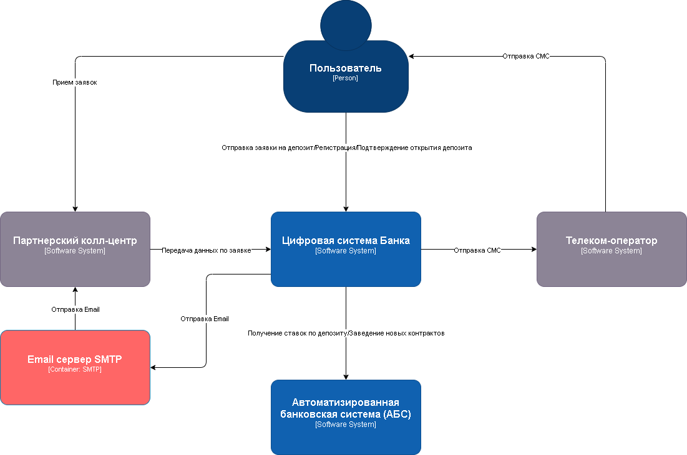

### **Название задачи: Передача ставок в кол-центр** 
### **Автор: Ирназаров Б.**
### **Дата: 01.09.2025**
### **Функциональные требования**

Для того чтобы наладить процесс передачи информации об актуальных ставках между банком и кол-центром, предлагается поднять сервис обработки запланированных задач - ***Асинхронная система очередей задач (АСЗ)***. Данная система хороша для выполнения запланированных и периодических задач.
Стек - Python, Celery, Redis (брокер сообщений). Поднимать систему будем через Docker-compose - в интернете много информации и примеров. Отправка файлов с актуальной информацией будет происходить по почте через внешний SMTP сервер. Файлы в формате XLSX, в сжатом ZIP виде с шифрованием. 

Так же рамках данной задачи, были добавлены дополнительные функциональные требования:
| Код | Функциональные требования (Functionality)                         | Комментарий  |
|-----|------------------------------------|--------------|
|     | *Колл-центр Банка*                |              |
| F9    | При превышении порога открытых заявок в системе колл-центра, передавать список открытых заявок в партнерский колл-центр                                |              |
| F10    | После обработки заявки колл-центр получает от партнерского колл-центра статус по заявкам в виде webhook                                 |              |
|     | *Асинхронная система очередей задач (АСЗ)*                |              |
| F11    | Ежедневно в 09:30 запрашивает актуальную информацию по ставкам депозитов из API АБС                                  |              |
| F12    | После получения актуальной ставки, отправляет email с вложенным файлом через внешний SMTP сервер                                  |              |
|       | 

Ниже приведены Use Cases, исходя из функциональных требований.

|**№**|**Действующие лица или системы**|**Use Case**|**Описание**|
| :-: | :- | :- | :- |
| UC4 | Пользователь, Сайт, Колл-центр, Партнерский колл-центр | 1. Пользователь переходит на сайт и видит список доступных депозитов с актуальными ставками  2. Пользователь оставляет заявку на депозит на сайте указав свой номер телефона и Ф.И.О. 3. Сайт передает данные по заявке в систему колл-центра  4. Превышен лимит открытых заявок колл-центра, отправляется запрос в партнерский колл-центр со списком открытых заявок.  5. Партнерский колл-центр обрабатывает заявки и передает статус по заявкам | Объединяем требования F1, F2, F3, F9, F10 в один Use Case |
| UC5 | АБС, АСЗ, SMPT-сервер, Партнерский колл-центр | 1. Ежедневно в 09:30 Асинхронная система очередей задач делает запрос в API АБС по актуальным ставкам депозитов.  2. После получения актуальной информации по ставкам, отправляет email сообщение с вложенным файлом в SMTP шлюз  3. SMTP сервер перенаправляет письмо в партнерский колл-центр | Объединяем требования F11, F12 в один Use Case |
|||||
### **Нефункциональные требования**
Нефункциональные требования остаются теми же что в задании 3.

|**№**|**Требование**|
| :-: | :- |
| **R**   | **Надёжность (Reliability)**           |              |
| R1    | Доступность системы 99,9%                                |              |
| R2    | Время работы всех сервисов 24/7.                                |              |
| R3    | Горячее резервирование между ЦОД                                |              |
| **P**   | **Производительность (Performance)**   |              |
| P1    | Отклик по всем операциям не более 100 миллисекунд                                |              |
| P2    | Исправить долгую загрузку данных из справочника > 1 сек                                |              |
| **+R**  | **+ Ограничения (Restrictions)**       |              |
| +R1    | БД АБС системы перегружена не может обеспечить работоспособность при большом кол-ве заявок                                 |              |
| +R2    | АБС система может масштабироваться только вертикально                                |              |
| +R3    | Запрещены прямые вызовы Интернет-банка с API АБС                                |              |
| +R4    | Использовать Kafka на перспективу, но текущая платформа ИБ с ней несовместима                                |              |
| +R5    | Рассмотреть перевод интернет-банка на микросервисную архитектуру, но пока только в рамках задачи открытия депозитов                                |              |
| +R6    | Чувствительные данные с Сайта и Интернет-банке необходимо шифровать                                |              |

### **Решение**
Диаграмма контекста C4

Диаграмма контейнеров C4

### **Альтернативы**
1. Прямые вызовы ИБ - АБС (SOAP/PLSQL): меньше компонентов, но сильная связность, риски безопасности, сложность версионирования
2. Событийная шина (Kafka) сразу: плюс масштаб и надёжность, но не совместимо с текущим ИБ на старте и резко повышает сложность

**Недостатки, ограничения, риски**

1. Устаревший стек в АБС (Delphi) - сложнее расширение и поддержка функционала
2. АБС может масштабироваться только вертикально из-за своей базы данных - в будущем это может создать риски для отказоустойчивости системы.
